<div align="center">

# SND Brightlife CBO

**Community management and financial services platform for member savings, table banking, lending and reporting.**


[Live application](https://brightlifesnd.com) · [Report an issue](https://github.com/MauriceOdhiambo/SND_BRIGHTLIFE/issues)

</div>

---

## Overview

SND Brightlife CBO is a digital platform that helps a community-based organisation run its day-to-day operations in one place: member management, savings, table banking, lending and repayments, communication, administration, reporting and community development activities.

The platform was **migrated from a Google Apps Script application to a production-oriented architecture on Vercel, Node.js and Supabase (PostgreSQL)**. The migration preserved the existing business workflows while adding server-side authentication, persistent sessions, rate limiting, scheduled operations, secure environment configuration and cloud-based integrations.

## Features

| Area | Capabilities |
| --- | --- |
| **Member management** | Register and manage member records |
| **Savings & table banking** | Track member savings and table banking activity |
| **Lending** | Loan issuing, repayments and overdue-loan monitoring |
| **Administration** | Admin operations and pending-approval workflows |
| **Communication** | Email through Resend and notifications through the WhatsApp Cloud API |
| **Reporting** | Automated daily, weekly and monthly summaries |
| **Payments** | Configurable Paybill number and account details shown to members |

## Architecture

```mermaid
flowchart LR
    U[Browser<br/>HTML · CSS · JavaScript] --> API[Vercel Serverless Functions<br/>api/server.js]
    CRON[Vercel Cron Jobs<br/>api/cron/&#91;job&#93;.js] --> API
    API --> DB[(Supabase<br/>PostgreSQL + RLS)]
    API --> MAIL[Resend<br/>Email]
    API --> WA[WhatsApp<br/>Cloud API]
```



**Before the migration**

```
Frontend  →  Google Apps Script  →  Supabase
```

**After the migration**

```
Frontend  →  Vercel Serverless Functions (Node.js)  →  Supabase / PostgreSQL
                     ↑                        ↘
             Vercel Cron Jobs           Resend · WhatsApp Cloud API
```

## Technology Stack

| Layer | Technology |
| --- | --- |
| Frontend | HTML, CSS, JavaScript |
| Backend | Node.js on Vercel Serverless Functions |
| Database | Supabase / PostgreSQL |
| Authentication | Server-managed sessions |
| Database security | PostgreSQL Row-Level Security (RLS) |
| Email | Resend |
| Notifications | WhatsApp Cloud API |
| Automation | Vercel Cron Jobs |
| Hosting & source control | Vercel · GitHub |

## Scheduled Jobs

Jobs are declared in [`vercel.json`](vercel.json) and run on Vercel Cron. Vercel schedules are in **UTC**; East Africa Time (EAT) is UTC+3.

| Job | Endpoint | Schedule (UTC) | Local time (EAT) |
| --- | --- | --- | --- |
| Overdue loans | `/api/cron/overdue-loans` | Daily, 03:00 | 06:00 |
| Daily summary | `/api/cron/daily-summary` | Daily, 05:00 | 08:00 |
| Weekly summary | `/api/cron/weekly-summary` | Mondays, 04:00 | 07:00 |
| Monthly summary | `/api/cron/monthly-summary` | 1st of the month, 04:00 | 07:00 |
| Pending approvals | `/api/cron/pending-approvals` | Daily, 07:00 and 13:00 | 10:00 and 16:00 |

Cron and server functions have a maximum duration of 60 seconds.

## Getting Started

### Prerequisites

- Node.js and npm
- A [Supabase](https://supabase.com) project with the application schema applied
- A [Vercel](https://vercel.com) account (for deployment)
- Optional: a [Resend](https://resend.com) account and a WhatsApp Cloud API app

### Installation

```bash
git clone https://github.com/MauriceOdhiambo/SND_BRIGHTLIFE.git
cd SND_BRIGHTLIFE
npm install
```

### Configuration

Copy the example environment file and fill in your own values:

```bash
cp .env.example .env.local
```

| Variable | Required | Description |
| --- | :---: | --- |
| `SUPABASE_URL` | Yes | Your Supabase project URL |
| `SUPABASE_SECRET_KEY` | Yes | Server-side Supabase secret key. Never expose it to the browser. |
| `CRON_SECRET` | Yes | Long random string used to authenticate scheduled job requests |
| `ADMIN_WHATSAPP` | No | Admin WhatsApp number in international format |
| `WHATSAPP_ACCESS_TOKEN` | No | WhatsApp Cloud API access token |
| `WHATSAPP_PHONE_NUMBER_ID` | No | WhatsApp Cloud API phone number ID |
| `RESEND_API_KEY` | No | Resend API key |
| `RESEND_FROM_EMAIL` | No | Verified sender address for outgoing email |
| `PAYBILL_NUMBER` | No | Paybill number displayed to members |
| `PAYBILL_ACCOUNT` | No | Account number displayed to members |

Generate a strong `CRON_SECRET` with:

```bash
openssl rand -hex 32
```

### Run locally

```bash
npm run dev
```

This starts the app and serverless functions through `vercel dev`.

## Deployment

1. Import the repository into Vercel.
2. Add the environment variables above under **Project Settings → Environment Variables**.
3. Deploy. Cron jobs defined in `vercel.json` are registered automatically on production deployments.

## Project Structure

```
.
├── api/
│   ├── server.js          # Main API entry point
│   └── cron/[job].js      # Scheduled job handler
├── index.html             # Frontend application
├── vercel.json            # Function limits, cron schedules, response headers
├── package.json           # Project metadata and dev script
├── .env.example           # Environment variable template
├── robots.txt             # Crawler rules
├── sitemap.xml            # Sitemap
├── wrangler.jsonc         # Cloudflare Workers static-asset configuration
└── .assetsignore          # Files excluded from static assets
```

## Security

- **Server-managed sessions** keep authentication on the server rather than in client code.
- **Row-Level Security** in PostgreSQL restricts data access at the database layer.
- **Rate limiting** protects the API from abuse.
- **Secrets stay server-side.** Keys and tokens live in environment variables and are never committed. Only `.env.example`, which contains placeholders, is tracked.
- **Authenticated cron endpoints** use `CRON_SECRET` so scheduled jobs cannot be triggered by arbitrary requests.

If you discover a security issue, please open a private report through GitHub's **Security** tab rather than a public issue.

## Author

**Maurice Odhiambo** · [GitHub](https://github.com/MauriceOdhiambo)
